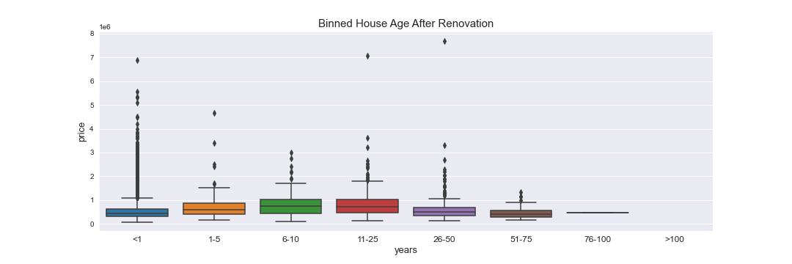
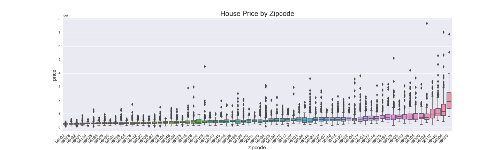
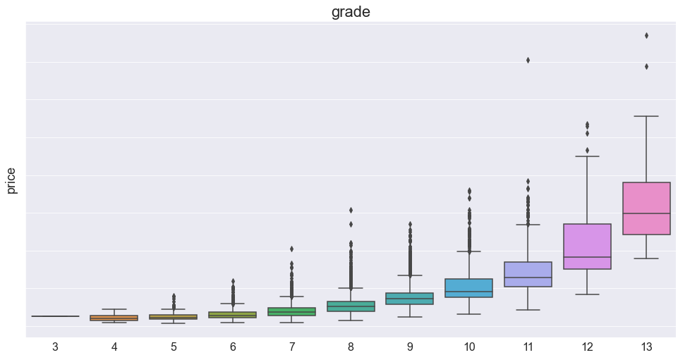
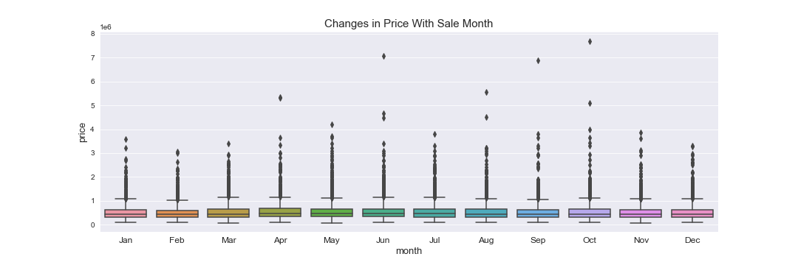
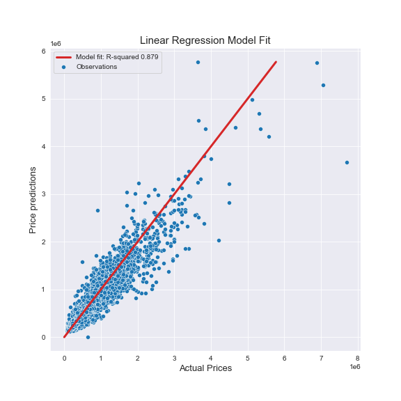

# Analysis of House Sales in a King's County

## Overview

This project focuses on housing prices in the northwestern part of Washington state. The data collected shows the prices of with other valuable information, such as date of construction, if the houses are renovated, the areas of square footage of different parts of the house and more. Based on the information provided, it is important to develop a model that can predict house prices not included in the dataset. The aspiration of this project is also to identify key metrics that are crucial to determine sale price. 

## Business and Data Understanding 

As potential house buyer, our clients need to make an informed decision when they decide to buy a house in King's County in Washington state. Therefore, the firm can set the price at which available houses could be sold at a marginally profitable value. For such analysis, a data was collected that shows the selling price of houses in 2014 and 2015. The data is analyzed in this notebook. Supplementary information such as grades and conditions assigned to a particular domicile can be accessed at [King County Assessor Website](https://info.kingcounty.gov/assessor/esales/Glossary.aspx?type=r). Data for this project was collected from [King's County official website](https://info.kingcounty.gov). The data contains rich information. However, we need to further inspect the data to understand what is available and how to make the best guess for missing data. This project will try to address the following question: 

- What are the primary factors for house pricing?
- Do zip codes, grades and other qualitative factors in the county determine house prices? 
- Are there unforeseen factors that could help predict housing price? 
- What is the best linear model to predict house prices in the future?
- What are the additional information required to help make better prediction?
- What are the recommendations based on the model generated? 


## Modeling

Multiple Linear regression was used in this project where almost all of the provided information are used to make prediction. Ten models were generated base on ranges in the house's number of years from construction to sale, number of years from renovation to sale, the month at which a sale was made, and additional factors such as how some aspects of the data mutually affect each other. 

The models were then evaluated for their performance and the best predictor model was selected. A few post-modeling assumption checks were made on all models prior to selection. The results from statistics and regression are presented as follows. 

## Results

Houses built 11 – 25 years before sale date price better than others but not by a significant margin. 



The costliest zip codes have significantly higher prices compared to others. 



Average grades range between 7 and 8 but grades appreciably increase with price.



The month of house sale does not significant have impact on price. 




### Regression Results 

The result of linear regression is shown below.



## Recommendations

Latitude and longitude appear to have dominating effect on the price. This could be a statistical error on the account of latitudes and longitudes have very small changes as we move from one house to the next.  

Some zip codes, namely 98168, 98178, 98198, 98032, 98023, 98188, 98055 and 98031, reduce the house price, while the remaining statistically significant zip codes appreciate it. Given the data at hand, it is hard to determine why this is but merits further investigation. Age also appears to have a negative effect on price as well. 

Waterfront properties increase the price significantly. Also, houses with excellent views and condition cost more than the rest. The number of floors, square footage of interior housing living space for the nearest 15 neighbors and basement, and number of years after renovation have no significance in predicting prices.

## Next Steps

The first step after this project would be to gather more data with that includes additional sale years. This can help to make better predictions as to how prices can vary with year. It also helps understand how the real estate business is responding to various economical fluctuations. 

It is also important to investigate why some zip codes have over/undervalued prices. This step might appear inconsequential to the firm from profits perspective but rather a public service to create equitable community. It could shade some light on municipal solutions as to why some houses are too expensive to afford.

As a firm with interest in making better predictions, however, including median earning by zip code can significantly increase the prediction accuracy. This goes hand-in-hand with gathering more data. 

The last important step is to use employ other predictive models, besides regression, that can perform significantly better. Regression requires data massaging before a good model is produced. Other models can, and most of the time, outperform linear regression.

## For More Information

See the full analysis in the [Jupyter Notebook](./student.ipynb) or review this [presentation](./project_2_presentation.pdf).

For additional info, contact the author at [afanta@alumni.cmu.edu](mailto:afanta@alumni.cmu.edu)

## Repository Structure

```
├── images
├── data
├── README.md
├── student.pdf
├── project_2_presentation.ipynb
└── model.pickle (download from https://drive.google.com/file/d/1PwhXl41smHc1z8XxgQeh96DkypdX-pUZ/view?usp=drivesdk)
